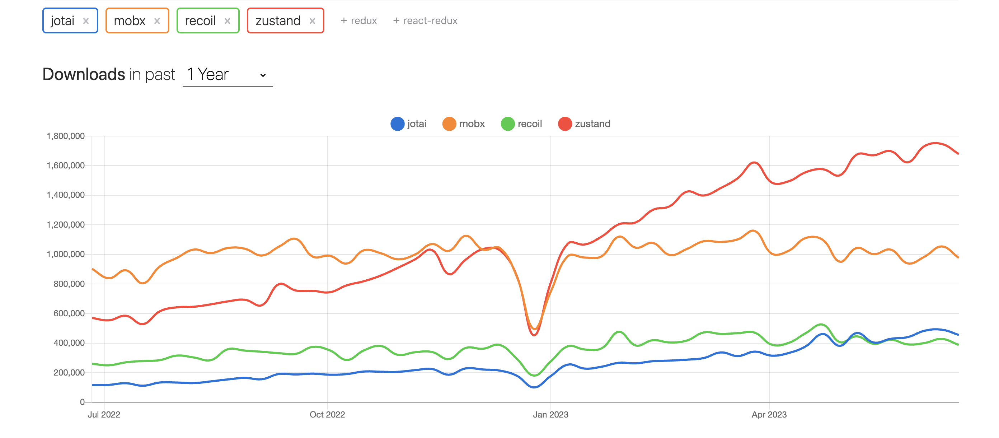

# zustand-practice

React.jsを使うにあたって、状態管理ライブラリを使うことも多いと思います。恐らく、最も一般的なものとしてReduxが挙げられると思いますが、それ以外に人気なライブラリがあるかどうかをnpm trendsで探してみると、Redux以外だとZustandというライブラリが最もインストールされていそうだったので(他に人気のライブラリがあったらすみません)、試してみることにしました。

